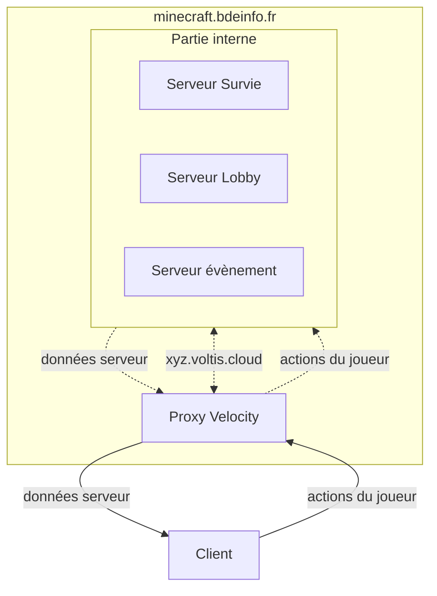

# Infrastructure

## Proxy et organisation des serveurs

:::tip Légende
Les flèches pointillées représentent les connexions dont l'utilisateur n'a pas connaissance.

Les flèches pleines correspondent, elles, aux connexions en lien direct avec le client
:::

On distingue 3 parties :

1. Le client
2. Le Proxy (minecraft.bdeinfo.fr)
3. La partie interne et ses serveurs

Lors de sa connexion au serveur, le client va se connecter au Proxy. Le proxy va agir comme un serveur minecraft vis-à-vis du client.

Le proxy, quant à lui, va immédiatement se connecter au premier serveur (dans notre cas, le lobby) et se comporter comme un client Minecraft classique vis-à-vis du serveur. Il enverra les données du client au serveur, et inversement.

# Sécurité et protection
Un proxy est particulièrement intéressant dans deux situations :

- L'utilisation de Load Balancer (pour répartir les clients sur plusieurs serveurs pour alléger la charge)
- L'utilisation de plusieurs serveurs distincts (serveur lobby, minage, faction, mini jeux ...)
Dans notre cas, nous sommes dans la 2e situation.

En effet, nous disposons d'un serveur Lobby, Survie et Évènement. L'utilisateur va, par défaut, se rendre sur le serveur lobby. Cependant, pour éviter de devoir se déconnecter du serveur, rentrer l'IP du serveur survie et s'y connecter, le proxy est là.

Si l'utilisateur change de serveur, c'est le proxy qui va gérer de manière opaque pour le client la déconnexion du premier serveur, et la connexion au second. Il va, de plus, transmettre certaines informations (Comme son pseudo par exemple)

:::info
Les serveurs ne sont pas connectés entre eux (et n'ont même pas reconnaissance des autres serveurs.). Ils sont seulement au courant de l'existence du Proxy.

C'est le proxy qui transmet les seules informations nécessaires. Le proxy est d'ailleurs le seul client à se connecter directement aux serveurs
:::

# Hébergement
Les serveurs qui hébergent cette infrastructure sont des serveurs Always Free d'Oracle.

Ils sont composés chacun de 4 Processeurs ARM Neoverse-N1, 24Go de ram, 200Go d'espace disque et d'une connexion théorique maximale de 4Gb/s.

Ces 3 serveurs sont basés :

À Londres
À Marseille
Et à Francfort
Le Proxy est mis en place sur le serveur de Londres pour sa proximité géographique avec Laval, et son ping légèrement plus faible.

Les serveurs Lobby, Survie et Évènement sont répartis sur les trois différents serveurs pour éviter de surcharger tous les serveurs.

Le ping moyen client-serveur et serveur-serveur est aux alentours de 20 à 25 ms.

Un 4e serveur est disponible okazou. Il s'agit d'un PowerEdge T330 de Dell ( Intel Xeon v6, 56 Go de ram, 2To en RAID 5, et ~ 1Gb/s théorique). Il est basé à Laval. Il n'est pas utilisé à cause du bruit qu'il pourrait générer.

# Serveur de jeu
Les serveurs (Lobby, Survie et Évènements) tournent sous paper, une version allégée de Spigot. Grâce à ce serveur, nous pouvons utiliser les plugins Bukkit sur un serveur optimisé (que ce soit en réseau ou au niveau des performances).

Le Velocity, optimisé pour paper, nous fait office de Proxy